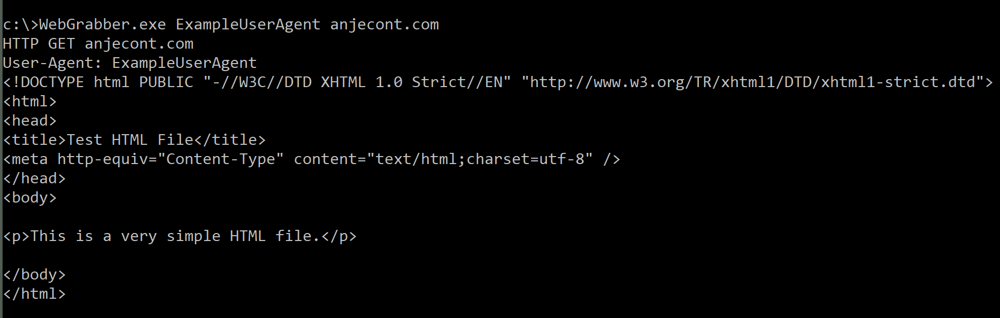

# web-grabber

A native Windows webpage grabber, written in C++.

The grabber allows for a custom UA String, performs a single HTTP GET request, obeys proxies and uses HTTP ports by default.

```
Usage: WebGrabber.exe <UAString> <Address>
```


